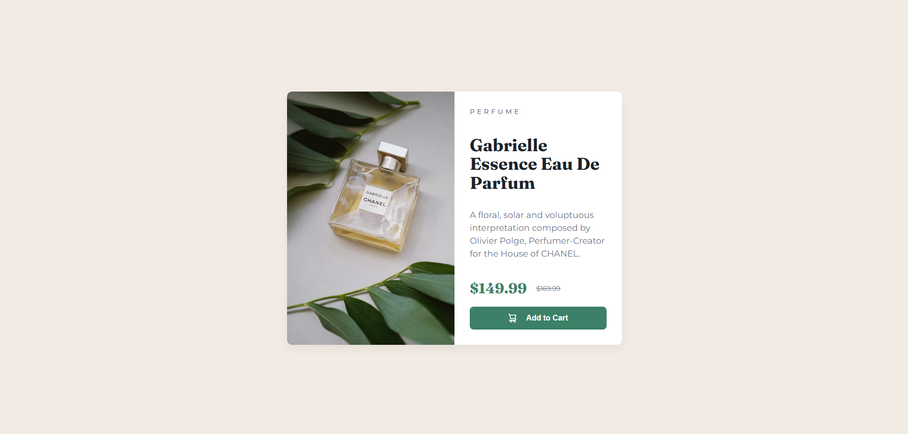

Обзор
Задача
Пользователи должны иметь возможность:

Видеть оптимальный макет в зависимости от размера экрана их устройства.

Видеть состояния наведения (hover) и фокуса для интерактивных элементов.

Ссылки
Ссылка на решение (GitHub): (https://github.com/TheTaff/product-preview-card?tab=readme-ov-file)

Ссылка на сайт (GitHub Pages): (https://thetaff.github.io/product-preview-card/)

Мой процесс:

Технологии
Семантическая верстка HTML5.

CSS Flexbox.

Методология Mobile-first.

Адаптивные изображения (тег <picture>).

Google Fonts (Montserrat и Fraunces).

Чему я научился
В ходе этого проекта я закрепил навыки работы с адаптивной версткой. Одной из интересных задач было управление пространством внутри текстового блока так, чтобы кнопка всегда оставалась внизу.

Я использовал display: flex и flex-direction: column для контента. Свойство justify-content: space-between в сочетании с height: 100% позволило равномерно распределить заголовок, описание и цену, прижав кнопку к нижней границе карточки.

Продолжение обучения
В будущих проектах я планирую глубже изучить CSS Grid для построения еще более сложных сеток, а также начать использовать методологию BEM (Блок-Элемент-Модификатор) для более чистого именования классов.